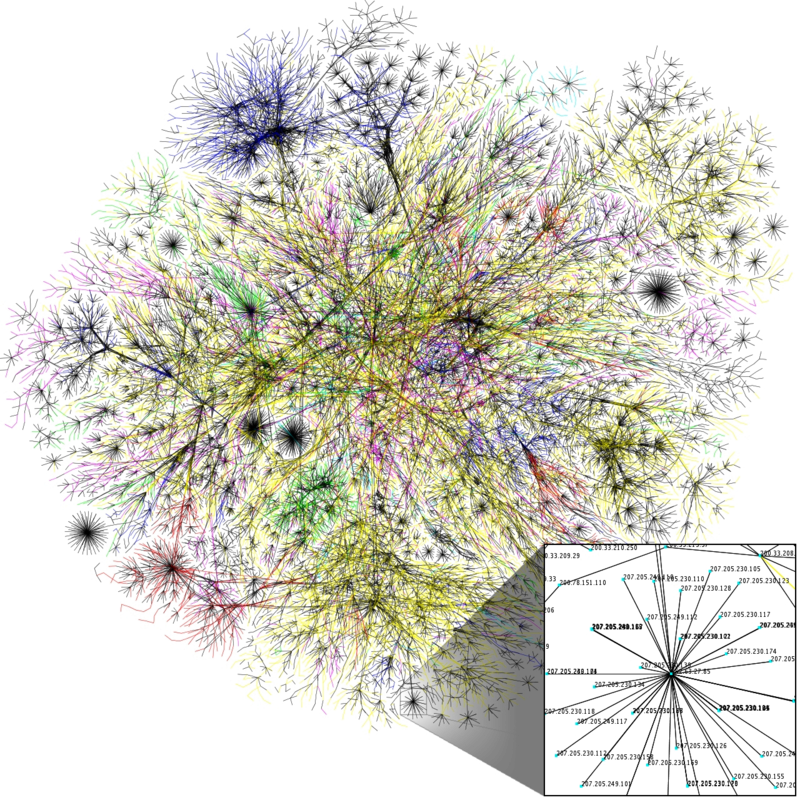

<h1>Porque me tornei um desenvolvedor?</h1>

</img>

<a href="https://www.opte.org/the-internet">Mais informações sobre a imagem acima</a>

Esse foi um mapeamento parcial da internet realizado com base em dados de 15 de janeiro de 2005 pela opte.org, seu aspecto lembra uma teia, neurônios de um cérebro, uma galáxia, o fato é que essa imagem me fez refletir sobre um fato que nunca havia pensado antes, através da computação, a humanidade criou uma realidade alternativa e apresentou a ela o reflexo da natureza humana, no momento em que nasceu o conceito de "usuário". 

Perceber isso foi o que me motivou a ser um desenvolvedor web, pois sou filósofo, e uma vez nessa condição, sinto-me na obrigação de chegar à verdade das questões através da especulação dentro de um escopo lógico, e essa realidade alternativa que criamos oferece um caminho lógico e belo para a verdade sobre a natureza humana.

